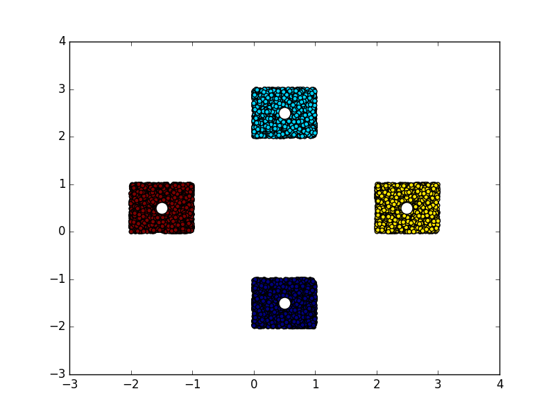

K-means using NVIDIA CUDA
=========================

The major difference between this project and others is that it is
optimized for low memory consumption and large number of clusters. E.g.,
kmcuda can sort 3M samples into 30000 clusters (if you have several days
and 6 GB of GPU memory).

Currently, the algorithm is a really brute-force approach which seems to
be the only one working at scale. kmeans++ initialization is supported,
though it takes a lot of time to finish.

This project is a library which exports the single function defined in
`wrappers.h`, `kmeans_cuda`. It has a built-in Python3 native extension
support, so you can `from libKMCUDA import kmeans_cuda`.

Building
--------
```
cmake -DCMAKE_BUILD_TYPE=Release . && make
```

Python example
--------------
```
import numpy
from matplotlib import pyplot
from libKMCUDA import kmeans_cuda

numpy.random.seed(0)
arr = numpy.empty((10000, 2), dtype=numpy.float32)
arr[:2500] = numpy.random.rand(2500, 2) + [0, 2]
arr[2500:5000] = numpy.random.rand(2500, 2) - [0, 2]
arr[5000:7500] = numpy.random.rand(2500, 2) + [2, 0]
arr[7500:] = numpy.random.rand(2500, 2) - [2, 0]
centroids, assignments = kmeans_cuda(arr, 4, kmpp=True, verbosity=1, seed=3)
print(centroids)
pyplot.scatter(arr[:, 0], arr[:, 1], c=assignments)
pyplot.scatter(centroids[:, 0], centroids[:, 1], c="white", s=150)
```
You should see something like this:
